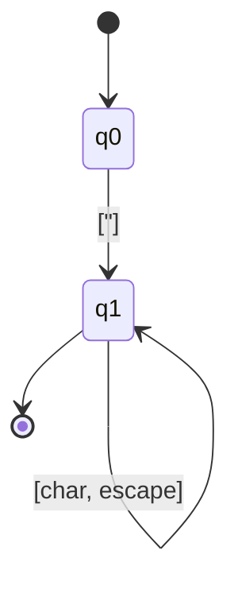
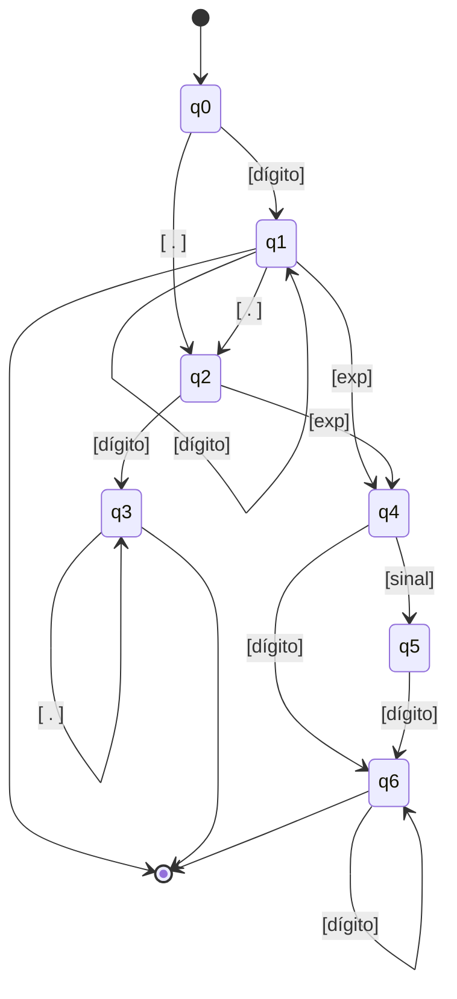
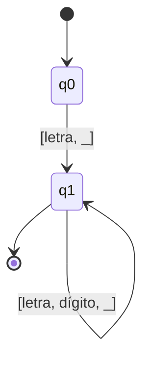
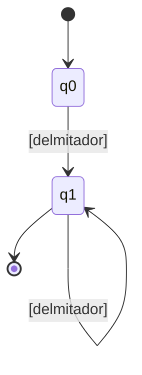
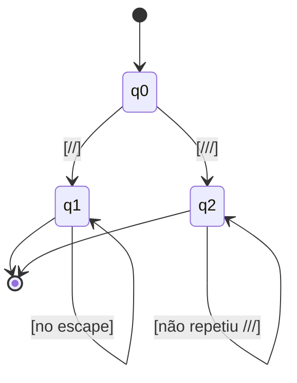

# String Literal

```mermaid                           
stateDiagram-v2

[*] --> q0
q0 --> q1: ["]
q1 --> q1: [char, escape]
q1 --> [*]
```

# Números

```mermaid
stateDiagram-v2
[*] --> q0
q0 --> q1: [dígito]
q1 --> q1: [dígito]
q0 --> q2: [ . ]
q1 --> q2: [ . ]
q1 --> q4: [exp]
q1 --> [*]
q2 --> q4: [exp]
q2 --> q3: [dígito]
q3 --> q3: [ . ]
q3 --> [*]
q4 --> q5: [sinal]
q4 --> q6: [dígito]
q5 --> q6: [dígito]
q6 --> q6: [dígito]
q6 --> [*]

```

# Identificadores

```mermaid                           
stateDiagram-v2

[*] --> q0
q0 --> q1: [letra, _]
q1 --> q1: [letra, dígito, _]
q1 --> [*]
```

# Delimitadores

```mermaid                           
stateDiagram-v2

[*] --> q0
q0 --> q1: [delmitador]
q1 --> q1: [delmitador]
q1 --> [*]
```

# Comentários

```mermaid                           
stateDiagram-v2

[*] --> q0
q0 --> q1: [//]
q1 --> q1: [no escape]
q1 --> [*]
q0 --> q2: [///]
q2 --> q2: [não repetiu ///]
q2 --> [*]
```
