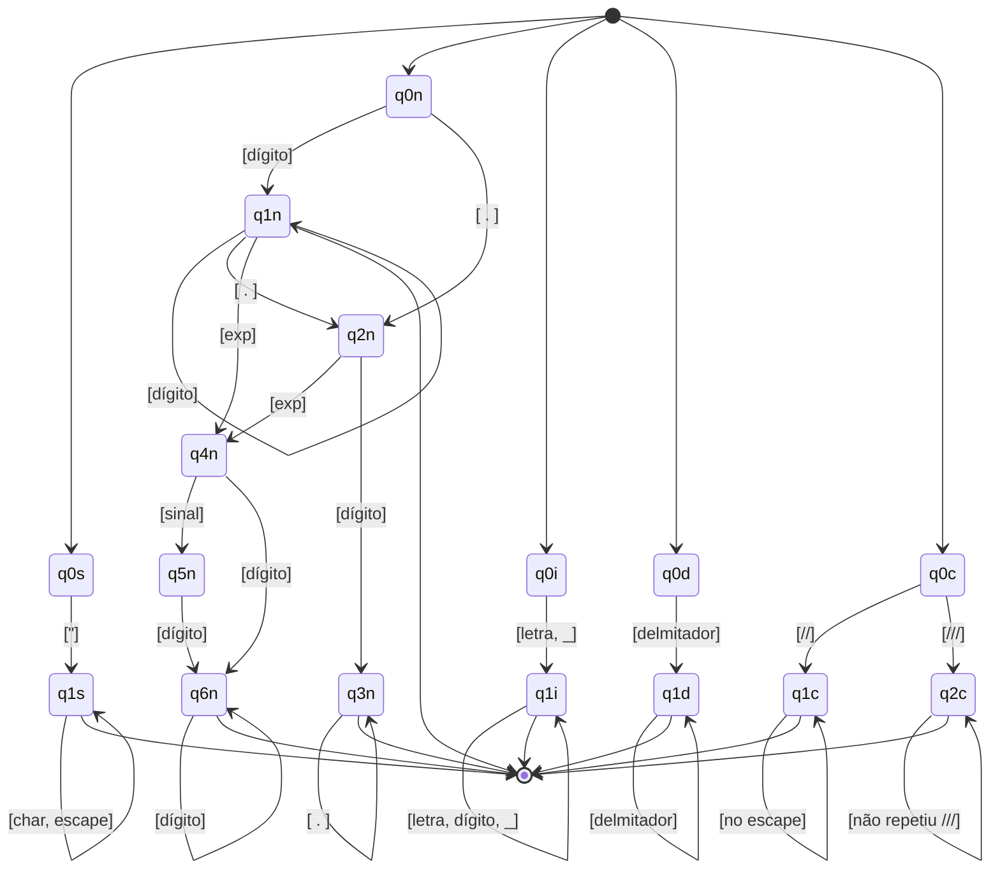

# AFN
## q0n: AFD número ; q0s: AFD string literal ; q0i: AFD identificador ; q0d: AFD delimitador ; q0c: AFD comentário

```mermaid                           
stateDiagram-v2

[*] --> q0s
q0s --> q1s: ["]
q1s --> q1s: [char, escape]
q1s --> [*]
[*] --> q0n
q0n --> q1n: [dígito]
q1n --> q1n: [dígito]
q0n --> q2n: [ . ]
q1n --> q2n: [ . ]
q1n --> q4n: [exp]
q1n --> [*]
q2n --> q4n: [exp]
q2n --> q3n: [dígito]
q3n --> q3n: [ . ]
q3n --> [*]
q4n --> q5n: [sinal]
q4n --> q6n: [dígito]
q5n --> q6n: [dígito]
q6n --> q6n: [dígito]
q6n --> [*]
[*] --> q0i
q0i --> q1i: [letra, _]
q1i --> q1i: [letra, dígito, _]
q1i --> [*]
[*] --> q0d
q0d --> q1d: [delmitador]
q1d --> q1d: [delmitador]
q1d --> [*]
[*] --> q0c
q0c --> q1c: [//]
q1c --> q1c: [no escape]
q1c --> [*]
q0c --> q2c: [///]
q2c --> q2c: [não repetiu ///]
q2c --> [*]
```

